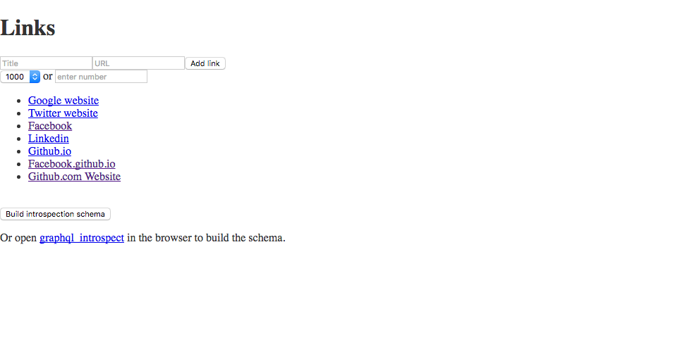
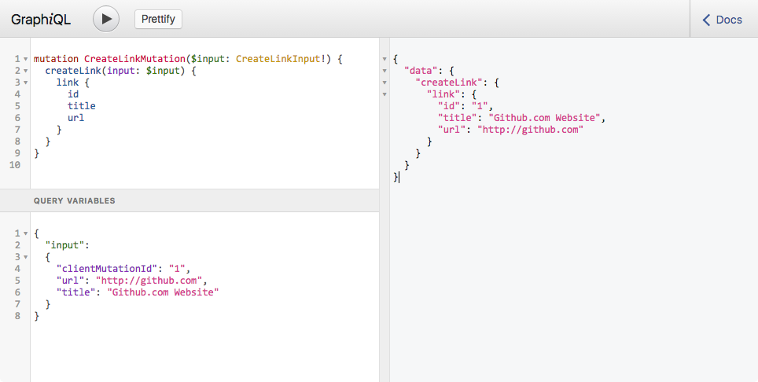

# PHP-RGR
PHP-React-GraphQL-Relay

This is a small [React](https://github.com/facebook/react) app, using [graphql-php](https://github.com/webonyx/graphql-php) and [graphql-relay-php](https://github.com/ivome/graphql-relay-php), also includes [graphiql](https://github.com/graphql/graphiql) interface.



##Example
App interface: https://zenitht.com/git/PHP-RGR/public/

GraphiQL interface: https://zenitht.com/git/PHP-RGR/public/graphiql

##Using the GraphiQL interface


You can manually insert new links via the GraphiQL interface, for example, in the query field enter:
```
mutation CreateLinkMutation($input: CreateLinkInput!) {
  createLink(input: $input) {
    link {
      id
      title
      url
    }
  }
}
```

... and pass variables in the Query variables field:
```
{
  "input":
  {
    "clientMutationId": "1",
    "url": "http://github.com",
    "title": "Github.com Website"
  }
}
```

##Installation
To run it locally, clone or download this repo to your server, then install the Composer packages:
```
composer install
```
Install the node packages via NPM:
```
npm install
```
Then run
```
webpack -wd
```

You'll also need a MongoDB instance.
